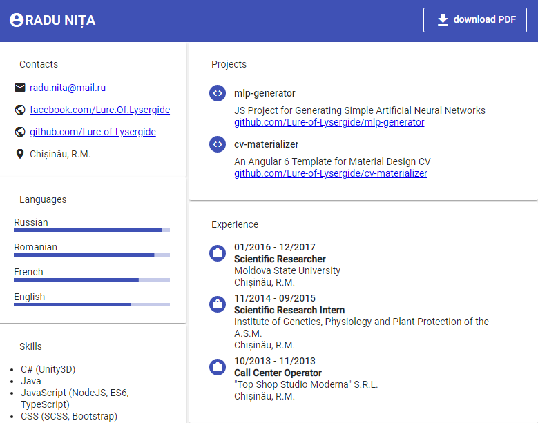

# cv-materializer

An Angular 6 Template for Material Design CV


  - [Getting Started](#getting-started)
    - [Prerequisites](#prerequisites)
    - [Installing](#installing)
    - [Using](#using)
  - [TODO](#todo)
  - [Built With](#built-with)
  - [Versioning](#versioning)
  - [Authors](#authors)
  - [License](#license)

## Getting Started

These instructions will get you a copy of the project up and running on your local machine for development and testing purposes.

### Prerequisites

- [Node.js 8.0+](https://nodejs.org/en/download)
- [NPM 6.0+](https://www.npmjs.com/get-npm)
- [Angular-CLI 6.0+](https://cli.angular.io)

### Installing

If you have [git](https://git-scm.com), you can install `cv-materializer` via [git clone](https://git-scm.com/docs/git-clone):

```bash
# Get the latest snapshot
git clone -b master https://github.com/Lure-of-Lysergide/cv-materializer

# Change directory
cd cv-materializer

# Install NPM dependencies
npm install

# Then start the Angular server
ng serve
```

### Notes about CSP

Currently, this project use `html2canvas` without proxying, so, if you want to create new PDFs you will need to disable [CSP](https://en.wikipedia.org/wiki/Content_Security_Policy) in your browser.

If you use Chrome, you can do it with [this](https://chrome.google.com/webstore/detail/disable-content-security/ieelmcmcagommplceebfedjlakkhpden/related) addon.

For this purposes, the [header](./src/app/header/header.component.html) was modified, so the download button doesn't trigger the `captureScreen()` function from [app.component.ts](./src/app/app.component.ts).

### Deploying

Build tha application by running:
```bash
ng build --prod
```

Then, copy all the files from `./dist/cv-materializer` to the root directory of your server

## TODO

- [ ] Redesign the application
- [ ] Add posibility to modify content in running app
- [ ] Add posibility to use Github account info for automatic CV generation 
- [ ] Think about how to bypass content security policy restrictions (for example add [this proxy](https://github.com/niklasvh/html2canvas-proxy-nodejs) for `html2canvas`)
- [ ] Replace the `html2canvas` and `jsPDF` libraries with `dom2pdf` or something like that
- [ ] Add `CHANGELOG`
- [ ] Add tests

## Built With

* [Angular 6](https://angular.io) - TypeScript-based open-source front-end framework
* [html2canvas](https://html2canvas.hertzen.com) - library for rendering the viewport
* [jsPDF](https://parall.ax/products/jspdf) - library for generating PDFs

## Versioning

This project use [SemVer](http://semver.org/) for versioning. For the versions available, see the [tags on this repository](https://github.com/Lure-of-Lysergide/cv-materializer/tags). 

## Authors

* **Niţa Radu** - *Initial work* - [Lysergide](https://github.com/Lure-of-Lysergide)

## License

This project is licensed under the MIT License - see the [LICENSE](LICENSE) file for details
